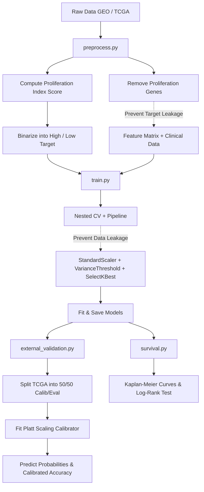

# 🧬 ColoGrowth-ML: Leakage-Free Colon Cancer Proliferation Class Predictor

[](https://www.python.org/)
[](LICENSE)
[](https://scikit-learn.org/)
[](https://portal.gdc.cancer.gov/)

Predicting colon cancer cell proliferation rate (tumor growth rate class) from gene expression profiles and clinical metadata using a mathematically rigorous, leakage-free machine learning pipeline.

---

## 📌 Project Overview & Motivation

Cellular proliferation is a fundamental hallmark of cancer. The rate at which tumor cells grow (proliferation index) serves as a vital prognostic marker. In clinical settings, proliferation is typically measured via histopathology staining (such as Ki-67 immunohistochemistry).

This project implements a **highly rigorous, end-to-end Machine Learning pipeline** to predict tumor proliferation class (High vs. Low) using:
1. **Transcriptomic Profiling**: High-dimensional gene expression profiles (microarray and RNA-seq data).
2. **Clinical Demographics**: Patient age, sex, and pathological tumor stage.

By leveraging gene expression signatures downstream of the primary cell cycle machinery, we computationally infer cell growth rates. This enables molecular tumor stratification and biomarker discovery without requiring manual immunohistochemistry (IHC) countings.

---

## 🛠️ Pipeline Architecture



### Key Scientific Design Choices

> [!IMPORTANT]
> **Target Leakage Prevention (Feature Filtering)**
> The target proliferation class (High vs. Low) is computed from the mean Z-score expression of a 10-gene cell-cycle hallmark signature (`MKI67`, `PCNA`, `TOP2A`, `MCM2`, `MCM6`, `AURKA`, `BUB1`, `CCNB1`, `CDK1`, and `BIRC5`). To prevent target leakage, all 10 genes are strictly removed from the feature matrix before model training. The models must learn from downstream transcriptional cascades, not the label drivers.

> [!TIP]
> **Data Leakage Prevention (Pipeline Encapsulation)**
> Preprocessing steps—including feature standardization (`StandardScaler`), low-variance filtering (`VarianceThreshold`), and ANOVA-based feature selection (`SelectKBest`)—are encapsulated inside a unified scikit-learn `Pipeline`. This guarantees that scaling and selection parameters are computed fold-locally during cross-validation, avoiding validation split leakage.

---

## 🧬 Datasets & Biological Sources

We utilize two primary public repositories of cancer genomics to demonstrate cohort-independent generalization:

1. **GEO (Gene Expression Omnibus) — [GSE39582](https://www.ncbi.nlm.nih.gov/geo/query/acc.cgi?acc=GSE39582)**:
   * **Platform**: Affymetrix GPL570 Microarray
   * **Size**: 585 colon tissue samples, ~22,000 features after probe mapping
   * **Target**: Binarized at the cohort median (292 Low, 293 High)
2. **TCGA-COAD (The Cancer Genome Atlas - Colon Adenocarcinoma)**:
   * **Platform**: Illumina HiSeq RNA-seq (STAR log2-normalized counts)
   * **Size**: 322 samples, matched clinical endpoints
   * **Target**: Matched clinical overall survival (OS) data and staging

---

## 📊 Summary of Results

### 1. Internal Validation (GEO Cohort — 585 samples)
Evaluated on an 80/20 train/test split. Cross-validation (CV) results reflect a nested 5-fold CV run on the training pool.

| Model | CV ROC-AUC (mean ± std) | Holdout Accuracy | Holdout ROC-AUC |
| :--- | :---: | :---: | :---: |
| **Logistic Regression** | $0.9801 \pm 0.0092$ | 0.9487 | 0.9939 |
| **Random Forest** | $0.9832 \pm 0.0094$ | 0.9316 | 0.9845 |
| **XGBoost** | $0.9756 \pm 0.0120$ | 0.9487 | 0.9915 |
| **Neural Network (MLP)** | $0.9711 \pm 0.0184$ | 0.9316 | 0.9828 |

### 2. External Validation & Platt Scaling (GEO $\rightarrow$ TCGA)
Evaluating models trained on GEO (microarray) directly on TCGA (RNA-seq) initially resulted in high discriminative capacity (ROC-AUC ~0.97) but poor default accuracy (~52%) due to cross-platform scale shifts. **Platt scaling** (fitting a post-hoc sigmoid probability calibrator on a 50% split of TCGA) successfully aligned the threshold, restoring competitive accuracy. We also developed soft-voting ensembles to integrate probabilities across models.

| Model | Raw AUC | Calibrated Accuracy | Calibrated Brier Score |
| :--- | :---: | :---: | :---: |
| **XGBoost** | 0.9071 | **0.8364** | **0.1311** |
| **Ensemble (Top-3 Models)** | 0.9131 | **0.8364** | **0.1307** |
| **Ensemble (All Models)** | 0.7110 | **0.7091** | **0.2079** |
| **Random Forest** | 0.6910 | **0.6970** | **0.2139** |
| **Neural Network (MLP)** | 0.9685 | **0.6848** | **0.1993** |
| **Logistic Regression** | 0.9775 | **0.6061** | **0.2212** |

---

## 📈 Clinical Correlation: Survival Analysis

To establish biological and clinical validity, we evaluated the association of our computed proliferation groups (High vs. Low) with patient overall survival (OS) using Kaplan-Meier curves and Log-Rank tests.

| Cohort | Log-Rank $p$-value | Significant? |
| :--- | :---: | :---: |
| **GEO GSE39582** | **$0.037$** | ✅ Yes ($p < 0.05$) |
| **TCGA-COAD** | **$0.034$** | ✅ Yes ($p < 0.05$) |

> [!NOTE]
> Patients categorized into the high-proliferation cohort showed a statistically significant reduction in overall survival time across both microarray and RNA-seq platforms, confirming the clinical utility of the computed labels.

---

## 📂 Repository Structure

```directory
ColoGrowth-ML/
├── data/
│   ├── raw/                  # Downloaded expression & clinical tables
│   └── processed/            # Cleaned, mapped, and filtered datasets
├── notebooks/
│   ├── 01_eda.ipynb          # Exploratory Data Analysis & visual check
│   ├── 02_preprocessing.ipynb # Walkthrough of normalization & target scoring
│   ├── 03_model_training.ipynb# Training loops & CV validation
│   └── 04_evaluation.ipynb   # Performance comparison, ROC, and SHAP
├── src/
│   ├── __init__.py           # Package declaration
│   ├── preprocess.py         # Probe-mapping, cell-cycle scoring, leakage filtering
│   ├── model.py              # ML classifier builders (LR, RF, XGB, MLP)
│   ├── train.py              # Nested CV, Pipeline tuning, model fitting
│   ├── evaluate.py           # Holdout evaluation (ROC, Confusion Matrix, SHAP)
│   ├── external_validation.py# Cross-cohort validation & Platt calibration
│   └── survival.py           # Kaplan-Meier curves and Log-Rank statistics
├── models/                   # Saved pipeline checkpoint binaries (.joblib)
├── results/                  # Plots, tables, and comparison matrices
├── paper/
│   ├── build_paper.py        # Generates Word (.docx) & LaTeX (.tex) papers
│   ├── build_pdf.py          # Compiles PDF report with real-data figures
│   └── paper_metrics.py      # Abstract and prose helpers
├── requirements.txt          # Python package requirements
├── LICENSE                   # MIT License
└── README.md                 # This documentation file
```

---

## ⚙️ Installation & Setup

1. **Clone the repository**:
   ```bash
   git clone https://github.com/Ronisnotasianfr/ColoGrowth-ML.git
   cd ColoGrowth-ML
   ```

2. **Install dependencies**:
   ```bash
   pip install -r requirements.txt
   ```

---

## 🚀 Execution Guide

### End-to-End CLI Pipeline

1. **Process & Align Data** (Download real datasets from GEO and UCSC Xena):
   ```bash
   python -m src.preprocess --download
   ```
   *(For a fast sanity check, you can run `python -m src.preprocess --synthetic` to generate 300 test samples)*

2. **Train Classifiers** (Runs nested cross-validation, tunes hyperparameters, and saves pipelines):
   ```bash
   python -m src.train --dataset geo
   ```

3. **Evaluate on Holdout** (Generates confusion matrices, ROC comparison curves, and SHAP plots):
   ```bash
   python -m src.evaluate --dataset geo
   ```

4. **Run Cross-Cohort Calibration** (Train on GEO microarray, calibrate and evaluate on TCGA RNA-seq):
   ```bash
   python -m src.external_validation --train-dataset geo --test-dataset tcga
   ```

5. **Generate Survival Outlines** (Produces Kaplan-Meier survival curves and p-values):
   ```bash
   python -m src.survival
   ```

6. **Rebuild the Research Paper** (Compiles the final Word/PDF report populated with real-data metrics):
   ```bash
   python paper/build_paper.py --dataset geo
   python paper/build_pdf.py --dataset geo
   ```

---

## ⚖️ Ethical Considerations & Disclaimer

> [!WARNING]
> This machine learning framework is developed for **educational and scientific research purposes only**.
> It is **NOT** a clinical diagnostic tool. The model predictions should not be used for patient diagnostics, treatment plans, or other clinical decisions without clinical trials, peer-reviewed validation, and regulatory approvals (such as FDA, EMA, or equivalents).

---

## 📚 References
* **Marisa et al.** *Gene expression Classification of Colon Cancer defines six molecular subtypes with distinct clinical, molecular and survival characteristics*. **PLoS Medicine**, 2013.
* **Whitfield et al.** *Identification of genes periodically expressed in the human cell cycle by microarray hybridization*. **Molecular Biology of the Cell**, 2002.
* **Lundberg & Lee.** *A Unified Approach to Interpreting Model Predictions*. **Advances in Neural Information Processing Systems (NeurIPS)**, 2017.
