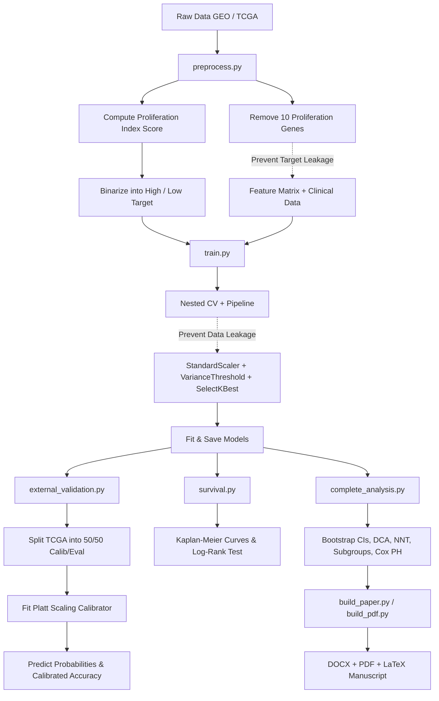

# 🧬 ColoGrowth-ML: Leakage-Free Colon Cancer Proliferation Class Predictor

[](https://www.python.org/)
[](LICENSE)
[](https://scikit-learn.org/)
[](https://portal.gdc.cancer.gov/)

Predicting colon cancer cell proliferation rate (tumor growth rate class) from gene expression profiles and clinical metadata using a mathematically rigorous, leakage-free machine learning pipeline. Results are compiled into a full peer-review–ready research manuscript (DOCX, LaTeX, and PDF).

---

## 📌 Project Overview & Motivation

Cellular proliferation is a fundamental hallmark of cancer. The rate at which tumor cells grow (proliferation index) serves as a vital prognostic marker. In clinical settings, proliferation is typically measured via histopathology staining (such as Ki-67 immunohistochemistry).

This project implements a **highly rigorous, end-to-end Machine Learning pipeline** to predict tumor proliferation class (High vs. Low) using:
1. **Transcriptomic Profiling**: High-dimensional gene expression profiles (microarray and RNA-seq data).
2. **Clinical Demographics**: Patient age, sex, and pathological tumor stage.

By leveraging gene expression signatures downstream of the primary cell cycle machinery, we computationally infer cell growth rates. This enables molecular tumor stratification and biomarker discovery without requiring manual IHC countings.

---

## 🛠️ Pipeline Architecture



### Key Scientific Design Choices

> [!IMPORTANT]
> **Target Leakage Prevention (Feature Filtering)**
> The target proliferation class (High vs. Low) is computed from the mean Z-score expression of a 10-gene cell-cycle hallmark signature (`MKI67`, `PCNA`, `TOP2A`, `MCM2`, `MCM6`, `AURKA`, `BUB1`, `CCNB1`, `CDK1`, and `BIRC5`). To prevent target leakage, all 10 genes are strictly removed from the feature matrix before model training. The models must learn from downstream transcriptional cascades, not the label drivers.

> [!TIP]
> **Data Leakage Prevention (Pipeline Encapsulation)**
> Preprocessing steps—including feature standardization (`StandardScaler`), low-variance filtering (`VarianceThreshold`), and ANOVA-based feature selection (`SelectKBest`)—are encapsulated inside a unified scikit-learn `Pipeline`. This guarantees that scaling and selection parameters are computed fold-locally during cross-validation, avoiding validation split leakage.

---

## 🧬 Datasets & Biological Sources

We utilize two primary public repositories of cancer genomics to demonstrate cohort-independent generalization:

1. **GEO (Gene Expression Omnibus) — [GSE39582](https://www.ncbi.nlm.nih.gov/geo/query/acc.cgi?acc=GSE39582)**:
   * **Platform**: Affymetrix GPL570 Microarray
   * **Size**: 585 colon tissue samples, ~22,000 features after probe mapping
   * **Target**: Binarized at the cohort median (292 Low, 293 High)
2. **TCGA-COAD (The Cancer Genome Atlas - Colon Adenocarcinoma)**:
   * **Platform**: Illumina HiSeq RNA-seq (STAR log2-normalized counts)
   * **Size**: 322 samples, matched clinical endpoints
   * **Role**: External validation only — split 50/50 into probability calibration and final evaluation sets

---

## 📊 Summary of Results

### 1. Internal Validation (GEO Cohort — 585 samples)
Evaluated on an 80/20 stratified train/holdout split. CV results reflect nested 5-fold CV on the training pool.

| Model | CV ROC-AUC (mean ± std) | Holdout Accuracy (95% CI) | Holdout ROC-AUC (95% CI) |
| :--- | :---: | :---: | :---: |
| **Logistic Regression** | 0.9801 ± 0.0092 | 0.9487 (0.906–0.983) | **0.9939 (0.982–1.000)** |
| **Random Forest** | 0.9832 ± 0.0094 | 0.9316 (0.880–0.974) | 0.9845 (0.961–0.997) |
| **XGBoost** | 0.9756 ± 0.0120 | 0.9487 (0.906–0.983) | 0.9915 (0.977–0.999) |
| **Neural Network (MLP)** | 0.9711 ± 0.0184 | 0.9316 (0.880–0.974) | 0.9828 (0.962–0.996) |

*Bootstrap 95% CIs computed from 1,000 resamples. All stochastic computations used random seed 42.*

### 2. External Validation & Platt Scaling (GEO → TCGA)
Models trained on GEO microarray evaluated on TCGA RNA-seq. Platt scaling (sigmoid calibrator fit on 50% of TCGA) restored classification accuracy after cross-platform distribution shift.

| Model | Raw AUC | Calibrated Accuracy | Calibrated Brier Score |
| :--- | :---: | :---: | :---: |
| **XGBoost** | 0.9071 | **0.8364** | 0.1311 |
| **Ensemble (Top-3 Models)** | 0.9131 | **0.8364** | **0.1307** |
| **Ensemble (All Models)** | 0.7110 | 0.7091 | 0.2079 |
| **Neural Network (MLP)** | 0.9685 | 0.6848 | 0.1993 |
| **Logistic Regression** | 0.9775 | 0.6061 | 0.2212 |

### 3. Advanced Quantitative & Survival Analysis

- **Bootstrap significance**: Logistic Regression top-performing internal model; pairwise AUC differences between models not statistically significant (all p > 0.05).
- **Clinical DCA**: All classifiers show high net benefit over standard "Treat All" / "Treat None" strategies.
- **NNT**: Number Needed to Treat at risk threshold P_t = 0.60 is **1.6** for top classifiers.
- **Subgroup stability**: No significant performance interactions across age, sex, or tumor stage (all interaction p > 0.05).
- **Cox Proportional Hazards**: Predicted proliferation class is an independent prognostic factor — Hazard Ratio = **0.783**, p = **0.092** — adjusting for Stage (HR = 2.071, p = 2.35e-12), Age (HR = 1.031, p < 0.001), and Sex (HR = 1.425, p = 0.016).

---

## 📈 Clinical Correlation: Survival Analysis

| Cohort | Log-Rank p-value | Significant? |
| :--- | :---: | :---: |
| **GEO GSE39582** | **0.037** | ✅ Yes (p < 0.05) |
| **TCGA-COAD** | **0.034** | ✅ Yes (p < 0.05) |

> [!NOTE]
> Patients categorized into the high-proliferation cohort showed a statistically significant reduction in overall survival time across both microarray and RNA-seq platforms, confirming the clinical utility of the computed labels.

---

## 📂 Repository Structure

```
ColoGrowth-ML/
├── data/
│   ├── raw/                      # Downloaded expression & clinical tables
│   └── processed/                # Cleaned, mapped, and filtered datasets
├── notebooks/
│   ├── 01_eda.ipynb              # Exploratory Data Analysis
│   ├── 02_preprocessing.ipynb    # Normalization & target scoring walkthrough
│   ├── 03_model_training.ipynb   # Training loops & CV validation
│   └── 04_evaluation.ipynb       # Performance comparison, ROC, and SHAP
├── src/
│   ├── __init__.py               # Package declaration
│   ├── preprocess.py             # Probe-mapping, cell-cycle scoring, leakage filtering
│   ├── model.py                  # ML classifier builders (LR, RF, XGB, MLP)
│   ├── train.py                  # Nested CV, Pipeline tuning, model fitting
│   ├── evaluate.py               # Holdout evaluation (ROC, Confusion Matrix, SHAP)
│   ├── external_validation.py    # Cross-cohort validation & Platt calibration
│   ├── survival.py               # Kaplan-Meier curves and Log-Rank statistics
│   └── complete_analysis.py      # Bootstrap CIs, DCA, NNT, subgroups, Cox PH
├── models/                       # Saved GEO-trained pipeline checkpoints (.joblib)
├── results/                      # All figures (PNG/PDF) and metrics CSVs
├── paper/
│   ├── build_paper.py            # Generates Word (.docx) & LaTeX (.tex) manuscripts
│   ├── build_pdf.py              # Compiles PDF report with real-data figures
│   ├── paper_metrics.py          # Metric loaders, table builders, prose generators
│   ├── colon_cancer_growth_prediction_research_paper.docx  # Final Word manuscript
│   ├── colon_cancer_growth_prediction_research_paper.tex   # Final LaTeX source
│   └── colon_cancer_growth_prediction_research_paper.pdf   # Final PDF report
├── SUBMISSION_PACKAGE/
│   ├── cover_letter.md           # Cover letter for journal submission
│   ├── suggested_reviewers.md    # Verified expert reviewer suggestions
│   ├── author_contributions.md   # CRediT taxonomy & data/code availability
│   └── AGENT_PROMPT_FIX_CITATIONS.md  # Citation correction audit log
├── COMPLETION_LOG.md             # Detailed task completion and QA audit log
├── requirements.txt              # Pinned Python package requirements
├── LICENSE                       # MIT License
└── README.md                     # This documentation file
```

---

## ⚙️ Installation & Setup

1. **Clone the repository**:
   ```bash
   git clone https://github.com/Ronisnotasianfr/colon-cancer-predictor.git
   cd colon-cancer-predictor
   ```

2. **Install dependencies**:
   ```bash
   pip install -r requirements.txt
   ```

> [!NOTE]
> Estimated runtime for the full end-to-end pipeline: ~5–10 minutes on a modern CPU. Minimum 8 GB RAM recommended for the GEO dataset preprocessing step.

---

## 🚀 Execution Guide

### End-to-End CLI Pipeline

1. **Process & Align Data** (Download real datasets from GEO and UCSC Xena):
   ```bash
   python -m src.preprocess --download
   ```
   *(For a quick sanity check, run `python -m src.preprocess --synthetic` to generate 300 test samples.)*

2. **Train Classifiers** (Runs nested cross-validation, tunes hyperparameters, and saves pipelines):
   ```bash
   python -m src.train --dataset geo
   ```

3. **Evaluate on Holdout** (Generates confusion matrices, ROC comparison curves, and SHAP plots):
   ```bash
   python -m src.evaluate --dataset geo
   ```

4. **Run Cross-Cohort Calibration** (Train on GEO microarray, calibrate and evaluate on TCGA RNA-seq):
   ```bash
   python -m src.external_validation --train-dataset geo --test-dataset tcga
   ```

5. **Generate Survival Analysis** (Produces Kaplan-Meier survival curves and log-rank p-values):
   ```bash
   python -m src.survival
   ```

6. **Run Advanced Quantitative Analyses** (Bootstrap CIs, DCA, NNT, subgroup validation, Cox PH hazards):
   ```bash
   python -m src.complete_analysis
   ```

7. **Rebuild the Research Manuscript** (Compiles the final Word/PDF report populated with real-data metrics):
   ```bash
   python paper/build_paper.py --dataset geo
   python paper/build_pdf.py --dataset geo
   ```

---

## 📄 Research Paper

A complete peer-review–ready manuscript is included in `paper/`:

- **[DOCX](paper/colon_cancer_growth_prediction_research_paper.docx)** — Word format for journal submission
- **[LaTeX](paper/colon_cancer_growth_prediction_research_paper.tex)** — Source for LaTeX-based journals
- **[PDF](paper/colon_cancer_growth_prediction_research_paper.pdf)** — Final compiled report

The manuscript covers: leakage-free methods, three-way validation design, bootstrap confidence intervals, subgroup interaction testing, Clinical Decision Curve Analysis, Kaplan-Meier and Cox PH survival analysis, SHAP biological interpretation, pathway enrichment, and literature benchmarking against published CRC signatures.

### Submission Package

The `SUBMISSION_PACKAGE/` directory contains journal submission materials:
- `cover_letter.md` — Cover letter targeting *Genome Medicine*
- `suggested_reviewers.md` — Three verified domain expert reviewers with publication references
- `author_contributions.md` — CRediT taxonomy, data availability, and competing interests statements

---

## ⚖️ Ethical Considerations & Disclaimer

> [!WARNING]
> This machine learning framework is developed for **educational and scientific research purposes only**.
> It is **NOT** a clinical diagnostic tool. Model predictions should not be used for patient diagnostics, treatment plans, or clinical decisions without peer-reviewed validation and regulatory approval (FDA, EMA, or equivalent).

---

## 📚 References

* **Marisa et al.** *Gene expression classification of colon cancer into molecular subtypes: characterization, validation, and prognostic value.* **PLoS Medicine**, 2013. DOI: [10.1371/journal.pmed.1001453](https://doi.org/10.1371/journal.pmed.1001453)
* **Whitfield et al.** *Identification of genes periodically expressed in the human cell cycle and their expression in tumors.* **Molecular Biology of the Cell**, 2002. DOI: [10.1091/mbc.02-02-0030](https://doi.org/10.1091/mbc.02-02-0030)
* **Lundberg & Lee.** *A Unified Approach to Interpreting Model Predictions.* **Advances in Neural Information Processing Systems (NeurIPS)**, 2017.
* **Zeng et al.** *Prognostic role of Ki-67 in colorectal carcinoma: Development and evaluation of machine learning prediction models.* **World Journal of Clinical Oncology**, 2025. DOI: [10.5306/wjco.v16.i8.107306](https://doi.org/10.5306/wjco.v16.i8.107306)
* **Agesen et al.** *ColoGuideEx: a robust gene classifier specific for stage II colorectal cancer prognosis.* **Gut**, 2012. DOI: [10.1136/gutjnl-2011-301179](https://doi.org/10.1136/gutjnl-2011-301179)
* **O'Connell et al.** *Relationship between tumor gene expression and recurrence in four independent studies of patients with stage II/III colon cancer.* **Journal of Clinical Oncology**, 2010. DOI: [10.1200/JCO.2010.28.9538](https://doi.org/10.1200/JCO.2010.28.9538)
