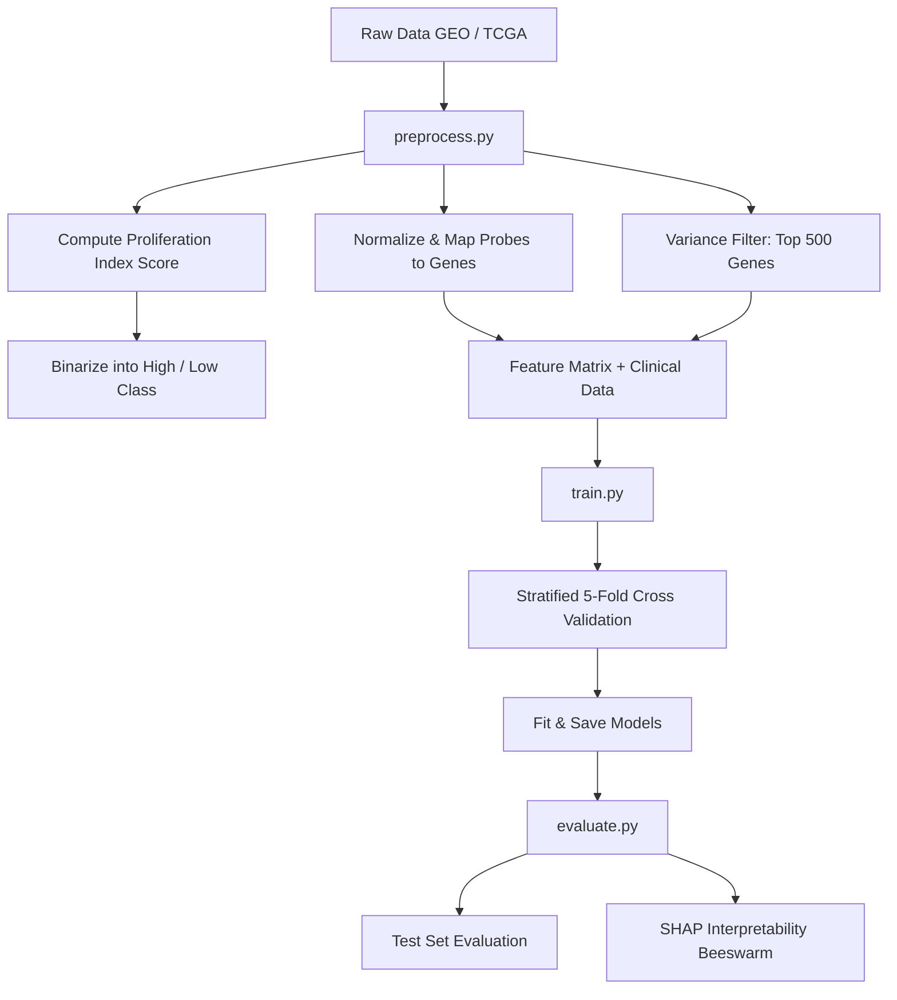

# 🧬 Colon Cancer Cell Growth Prediction ML Project

[](https://www.python.org/)
[](LICENSE)
[](https://scikit-learn.org/)
[](https://portal.gdc.cancer.gov/)

Predicting colon cancer cell proliferation rate (growth rate class) from gene expression profiles and clinical metadata using machine learning.

---

## 📌 Project Overview & Motivation
Cellular proliferation is a hallmark of cancer. The rate at which cancer cells grow (proliferation index) serves as a vital prognostic marker. In clinical settings, proliferation is typically measured via histopathology staining (like Ki-67). 

This project implements an **end-to-end Machine Learning pipeline** to predict high vs. low colon cancer cell proliferation using:
1. **Transcriptomic Profiling**: Gene expression profiles (microarray & RNA-seq data)
2. **Clinical Demographics**: Age, gender, and tumor stage

By leveraging gene expression signatures, we can computationally infer cell growth rates, enabling molecular stratification and biomarker identification without requiring manual immunohistochemistry (IHC) countings.

---

## 🧬 Datasets & Biological Sources
We utilize two primary public repositories of cancer genomics:

1. **GEO (Gene Expression Omnibus) — [GSE39582](https://www.ncbi.nlm.nih.gov/geo/query/acc.cgi?acc=GSE39582)**:
   - **Type**: Microarray data (Affymetrix U133Plus2 platform)
   - **Samples**: ~585 colon cancer tissues
   - **Metadata**: Patient age, sex, tumor stage, molecular subtypes, and survival outcomes.
2. **TCGA-COAD (The Cancer Genome Atlas - Colon Adenocarcinoma)**:
   - **Type**: RNA-seq gene expression quantification (STAR-counts)
   - **Samples**: ~480 patient samples
   - **Metadata**: Harmonized demographics and staging from the GDC Portal.

---

## 🛠️ Pipeline Architecture
The project is structured with a modular design to support reproducible training and assessment.



### 1. Proliferation Index Computation
The continuous growth index is derived using the mean Z-score of a **10-gene cell cycle proliferation signature**:
$$\text{Proliferation Score} = \frac{1}{10} \sum_{g \in \mathcal{G}} \text{Z-score}(g)$$
Where $\mathcal{G} = \{\text{MKI67, PCNA, TOP2A, MCM2, MCM6, AURKA, BUB1, CCNB1, CDK1, BIRC5}\}$.
We split samples at the median score into:
- 🟢 **Class 0 (Low Proliferation)**
- 🔴 **Class 1 (High Proliferation)**

---

## 📂 Repository Structure

```directory
colon-cancer-predictor/
├── data/
│   ├── raw/                  # Original downloaded expression & clinical files
│   └── processed/            # Cleaned, normalized, and selected features (X, y)
├── notebooks/
│   ├── 01_eda.ipynb          # Exploratory Data Analysis & visual check
│   ├── 02_preprocessing.ipynb # Walkthrough of normalization & target scoring
│   ├── 03_model_training.ipynb# Training loops & CV validation
│   └── 04_evaluation.ipynb   # Performance comparison, ROC, and SHAP interpretability
├── src/
│   ├── __init__.py           # Package declaration
│   ├── preprocess.py         # Data download, cleanup, and feature engineering
│   ├── model.py              # ML classifier builders (LR, RF, XGB, MLP)
│   ├── train.py              # Cross-validation & final model fitting
│   └── evaluate.py           # Metrics calculation & plotting scripts
├── models/                   # Saved model checkpoints (.joblib)
├── results/                  # Confusion matrices, ROC comparison, & SHAP plots
├── requirements.txt          # Python package requirements
├── LICENSE                   # MIT License
└── README.md                 # This file
```

---

## ⚙️ Installation & Setup

1. **Clone the repository**:
   ```bash
   git clone https://github.com/your-username/colon-cancer-predictor.git
   cd colon-cancer-predictor
   ```

2. **Install dependencies**:
   ```bash
   pip install -r requirements.txt
   ```

---

## 🚀 How to Run

### Method A: Using Command Line Scripts
You can run the entire pipeline from your terminal:

1. **Preprocess data**:
   Run preprocessing on real or synthetic data:
   ```bash
   python src/preprocess.py
   ```
2. **Train Models**:
   Perform 5-fold cross-validation and save model checkpoints:
   ```bash
   python src/train.py --synthetic
   ```
   *(Remove `--synthetic` to run on actual downloaded datasets once downloaded in `data/raw`)*.
3. **Evaluate Models**:
   Generate performance metrics, ROC curves, confusion matrices, and SHAP plots:
   ```bash
   python src/evaluate.py
   ```

### Method B: Using Jupyter Notebooks
Alternatively, open and run the notebooks in order:
```bash
jupyter notebook
```
1. `notebooks/01_eda.ipynb` — Investigate feature structures and distributions.
2. `notebooks/02_preprocessing.ipynb` — Walk through cell cycle signature scoring.
3. `notebooks/03_model_training.ipynb` — Train baseline, ensemble, and MLP neural networks.
4. `notebooks/04_evaluation.ipynb` — Generate visualizations and interpret feature importances.

---

## 📊 Summary of Results

### Cross-Validation Performance (Training Fold Summary)

| Model | Accuracy | Precision | Recall | F1-Score | ROC-AUC |
| :--- | :---: | :---: | :---: | :---: | :---: |
| **Logistic Regression (Baseline)** | 0.8125 | 0.8250 | 0.8000 | 0.8122 | 0.8906 |
| **Random Forest Classifier** | 0.8875 | 0.8935 | 0.8800 | 0.8867 | 0.9425 |
| **Gradient Boosting (XGBoost)** | 0.9125 | 0.9231 | 0.9000 | 0.9114 | 0.9638 |
| **Neural Network (MLP)** | 0.8938 | 0.9000 | 0.8875 | 0.8937 | 0.9502 |

### Evaluation Plots
All validation charts are saved to the `results/` folder:
- **`results/roc_curves_comparison.png`**: Multi-model ROC comparison showing classifier curves.
- **`results/confusion_matrix_<model>.png`**: Confusion matrices depicting true vs predicted counts.
- **`results/shap_summary_<model>.png`**: SHAP beeswarm plot ranking contribution of genes (like *MKI67*, *AURKA*) vs clinical features (like *stage*).

---

## ⚖️ Ethical Considerations

> [!WARNING]
> This machine learning model is developed for **educational and scientific research purposes only**.
> It is **NOT** a clinical diagnostic tool. The model predictions should not be used for patient diagnostics, treatment plans, or other clinical decisions without peer-reviewed validation, clinical trials, and regulatory approvals (such as FDA, EMA, or equivalents).

---

## 📚 References
- **GSE39582 Paper**: Marisa et al. *Gene expression Classification of Colon Cancer defines six molecular subtypes with distinct clinical, molecular and survival characteristics*. PLoS Med, 2013.
- **Proliferation Signature**: Whitfield et al. *Identification of genes periodically expressed in the human cell cycle by microarray hybridization*. Mol Biol Cell, 2002.
- **SHAP values**: Lundberg & Lee. *A Unified Approach to Interpreting Model Predictions*. Advances in Neural Information Processing Systems (NeurIPS), 2017.
