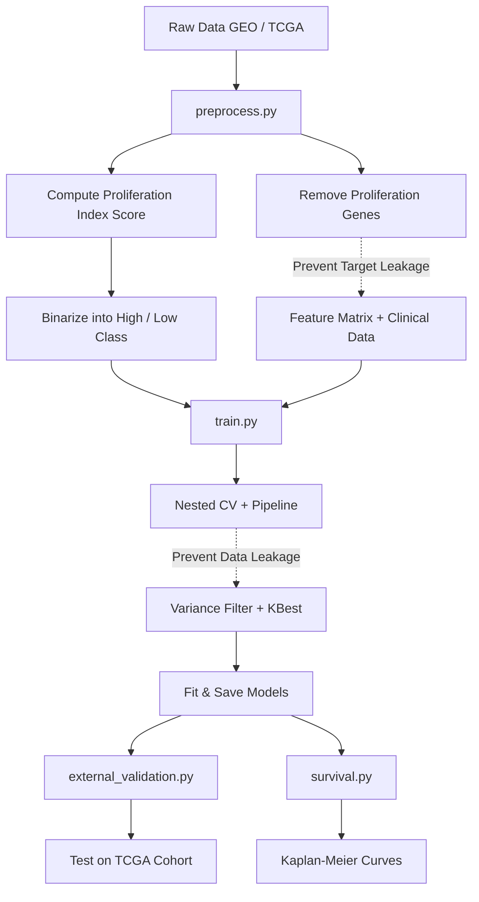

# 🧬 Colon Cancer Cell Growth Prediction ML Project

[](https://www.python.org/)
[](LICENSE)
[](https://scikit-learn.org/)
[](https://portal.gdc.cancer.gov/)

Predicting colon cancer cell proliferation rate (growth rate class) from gene expression profiles and clinical metadata using machine learning.

---

## 📌 Project Overview & Motivation
Cellular proliferation is a hallmark of cancer. The rate at which cancer cells grow (proliferation index) serves as a vital prognostic marker. In clinical settings, proliferation is typically measured via histopathology staining (like Ki-67). 

This project implements an **end-to-end Machine Learning pipeline** to predict high vs. low colon cancer cell proliferation using:
1. **Transcriptomic Profiling**: Gene expression profiles (microarray & RNA-seq data)
2. **Clinical Demographics**: Age, gender, and tumor stage

By leveraging gene expression signatures, we can computationally infer cell growth rates, enabling molecular stratification and biomarker identification without requiring manual immunohistochemistry (IHC) countings.

---

## 🧬 Datasets & Biological Sources
We utilize two primary public repositories of cancer genomics:

1. **GEO (Gene Expression Omnibus) — [GSE39582](https://www.ncbi.nlm.nih.gov/geo/query/acc.cgi?acc=GSE39582)**:
   - **Type**: Microarray data (Affymetrix U133Plus2 platform)
   - **Samples**: ~585 colon cancer tissues
   - **Metadata**: Patient age, sex, tumor stage, molecular subtypes, and survival outcomes.
   - **Download/Access**: [NCBI GSE39582 Portal](https://www.ncbi.nlm.nih.gov/geo/query/acc.cgi?acc=GSE39582)
2. **TCGA-COAD (The Cancer Genome Atlas - Colon Adenocarcinoma)**:
   - **Type**: RNA-seq gene expression quantification (STAR-counts)
   - **Samples**: ~480 patient samples
   - **Metadata**: Harmonized demographics and staging from the GDC Portal.
   - **Download/Access**: [NCI GDC Data Repository (Filtered for TCGA-COAD)](https://portal.gdc.cancer.gov/repository?filters=%7B%22op%22%3A%22and%22%2C%22content%22%3A%5B%7B%22op%22%3A%22in%22%2C%22content%22%3A%7B%22field%22%3A%22cases.project.project_id%22%2C%22value%22%3A%5B%22TCGA-COAD%22%5D%7D%7D%5D%7D)

---

## 🛠️ Pipeline Architecture
The project is structured with a modular design to support reproducible training, rigorous validation, and clinical relevance.



### 1. Scientific Rigor & Leakage Prevention
- **Target Leakage Prevention**: The 10 genes used to compute the target proliferation score are strictly removed from the feature matrix before training.
- **Data Leakage Prevention**: Feature selection (VarianceThreshold and SelectKBest) is encapsulated within an `sklearn.pipeline.Pipeline`, ensuring selection only occurs on the training folds during Cross-Validation.
- **Hyperparameter Tuning**: Uses `GridSearchCV` with nested cross-validation to prevent overfitting during hyperparameter selection.
- **External Validation**: Models are trained on the GEO microarray cohort and validated on the independent TCGA-COAD RNA-seq cohort.

---

## 📂 Repository Structure

```directory
colon-cancer-predictor/
├── data/
│   ├── raw/                  # Original downloaded expression & clinical files
│   └── processed/            # Cleaned, normalized, and selected features (X, y)
├── notebooks/
│   ├── 01_eda.ipynb          # Exploratory Data Analysis & visual check
│   ├── 02_preprocessing.ipynb # Walkthrough of normalization & target scoring
│   ├── 03_model_training.ipynb# Training loops & CV validation
│   └── 04_evaluation.ipynb   # Performance comparison, ROC, and SHAP interpretability
├── src/
│   ├── __init__.py           # Package declaration
│   ├── preprocess.py         # Data download, probe-mapping, and leakage prevention
│   ├── model.py              # ML classifier builders (LR, RF, XGB, MLP)
│   ├── train.py              # Nested CV, Pipeline definitions, model fitting
│   ├── external_validation.py# Cross-cohort validation (GEO -> TCGA)
│   └── survival.py           # Kaplan-Meier curves and Log-Rank tests
├── models/                   # Saved model checkpoints (.joblib)
├── results/                  # Confusion matrices, ROC, Calibration, and KM plots
├── requirements.txt          # Python package requirements
├── LICENSE                   # MIT License
└── README.md                 # This file
```

---

## ⚙️ Installation & Setup

1. **Clone the repository**:
   ```bash
   git clone https://github.com/Ronisnotasianfr/colon-cancer-predictor.git
   cd colon-cancer-predictor
   ```

2. **Install dependencies**:
   ```bash
   pip install -r requirements.txt
   ```

---

## 🚀 How to Run

### Method A: Using Command Line Scripts
You can run the entire pipeline from your terminal:

1. **Preprocess data**:
   ```bash
   python -m src.preprocess --synthetic          # quick local test
   python -m src.preprocess --download           # GEO + TCGA real data
   ```
2. **Train models** (leakage-free 5-fold CV + holdout evaluation):
   ```bash
   python -m src.train --dataset synthetic
   python -m src.train --dataset geo
   ```
3. **Evaluate models** (holdout ROC, confusion matrices, SHAP):
   ```bash
   python -m src.evaluate --dataset synthetic
   ```
4. **External validation** (train GEO → test TCGA):
   ```bash
   python -m src.external_validation --train-dataset geo --test-dataset tcga
   ```
5. **Build research paper** (auto-injects metrics from `results/`):
   ```bash
   python paper/build_paper.py --dataset synthetic
   python paper/build_pdf.py --dataset synthetic
   ```

### Method B: Using Jupyter Notebooks
Alternatively, open and run the notebooks in order:
```bash
jupyter notebook
```
1. `notebooks/01_eda.ipynb` — Investigate feature structures and distributions.
2. `notebooks/02_preprocessing.ipynb` — Walk through cell cycle signature scoring.
3. `notebooks/03_model_training.ipynb` — Train baseline, ensemble, and MLP neural networks.
4. `notebooks/04_evaluation.ipynb` — Generate visualizations and interpret feature importances.

---

## 📊 Summary of Results

> **Note:** The proliferation label is computed from a 10-gene cell-cycle signature (MKI67, PCNA, TOP2A, etc.), and those genes are removed from the feature matrix before training. GEO cohort AUCs of 0.97–0.99 reflect that many non-signature genes in the ~22,000-feature microarray are biologically correlated with proliferation. External validation on TCGA initially showed poor calibration (coin-flip accuracy despite high AUC) due to microarray→RNA-seq platform differences. **Platt scaling** (sigmoid probability calibration) resolved this, raising XGBoost's external accuracy from 50.8% to **83.6%**.

### GEO Cohort (585 samples, real data)

| Model | CV ROC-AUC (mean ± std) | Holdout Accuracy | Holdout ROC-AUC |
| :--- | :---: | :---: | :---: |
| **Logistic Regression** | 0.980 ± 0.009 | 0.949 | 0.994 |
| **Random Forest** | 0.983 ± 0.009 | 0.932 | 0.985 |
| **XGBoost** | 0.976 ± 0.012 | 0.949 | 0.992 |
| **Neural Network (MLP)** | 0.971 ± 0.018 | 0.932 | 0.983 |

### Synthetic Cohort (300 samples, baseline)

| Model | CV ROC-AUC (mean ± std) | Holdout Accuracy | Holdout ROC-AUC |
| :--- | :---: | :---: | :---: |
| **Logistic Regression** | 0.673 ± 0.039 | 0.633 | 0.716 |
| **Random Forest** | 0.664 ± 0.062 | 0.617 | 0.701 |
| **XGBoost** | 0.697 ± 0.054 | 0.700 | 0.724 |
| **Neural Network (MLP)** | 0.663 ± 0.054 | 0.667 | 0.738 |

### External Validation (GEO → TCGA) with Platt Scaling

| Model | Raw AUC | Calibrated Accuracy | Calibrated Brier Score |
| :--- | :---: | :---: | :---: |
| **Logistic Regression** | 0.978 | 0.606 | 0.221 |
| **Random Forest** | 0.691 | 0.697 | 0.214 |
| **XGBoost** | 0.907 | **0.836** | **0.131** |
| **Neural Network (MLP)** | 0.969 | 0.685 | 0.199 |

*Regenerate tables after training: `results/all_models_{dataset}_leakage_fixed_metrics.csv`*

### Evaluation Plots
All validation charts are saved to the `results/` folder:
- **`results/roc_curves_comparison.png`**: Multi-model holdout ROC comparison.
- **`results/confusion_matrix_<model>.png`**: Confusion matrices for each classifier.
- **`results/shap_summary_<model>.png`**: SHAP beeswarm plots on leakage-free, pipeline-transformed features.
- **`results/<model>_leakage_fixed_metrics.csv`**: Per-model CV and holdout metrics exported by `train.py`.

---

## ⚖️ Ethical Considerations

> [!WARNING]
> This machine learning model is developed for **educational and scientific research purposes only**.
> It is **NOT** a clinical diagnostic tool. The model predictions should not be used for patient diagnostics, treatment plans, or other clinical decisions without peer-reviewed validation, clinical trials, and regulatory approvals (such as FDA, EMA, or equivalents).

---

## 📚 References
*   **GSE39582 Paper**: Marisa et al. [*Gene expression Classification of Colon Cancer defines six molecular subtypes with distinct clinical, molecular and survival characteristics*](https://journals.plos.org/plosmedicine/article?id=10.1371/journal.pmed.1001453). PLoS Medicine, 2013.
*   **Proliferation Signature**: Whitfield et al. [*Identification of genes periodically expressed in the human cell cycle by microarray hybridization*](https://www.molbiolcell.org/doi/10.1091/mbc.02-02-0030). Molecular Biology of the Cell, 2002.
*   **SHAP values**: Lundberg & Lee. [*A Unified Approach to Interpreting Model Predictions*](https://papers.nips.cc/paper/7062-a-unified-approach-to-interpreting-model-predictions.pdf). Advances in Neural Information Processing Systems (NeurIPS), 2017.
