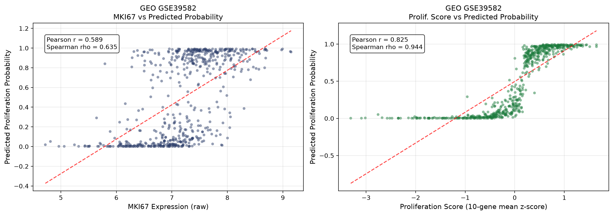
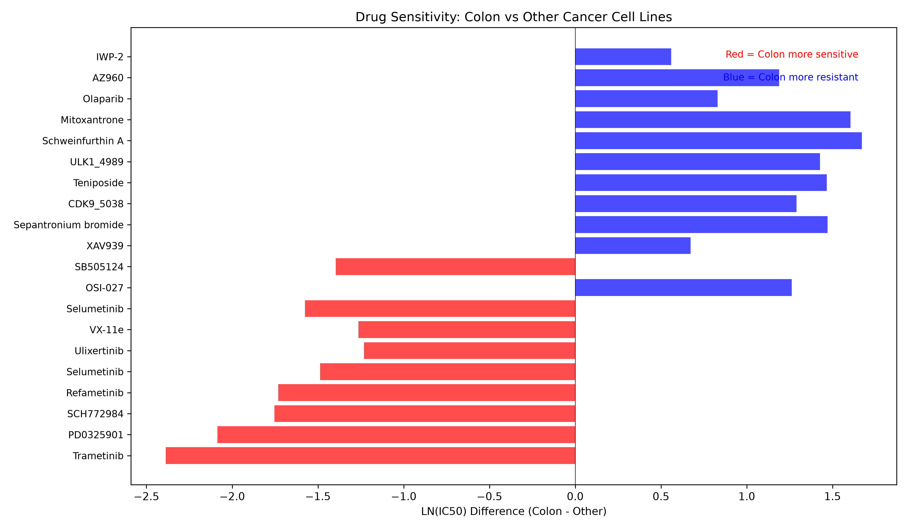
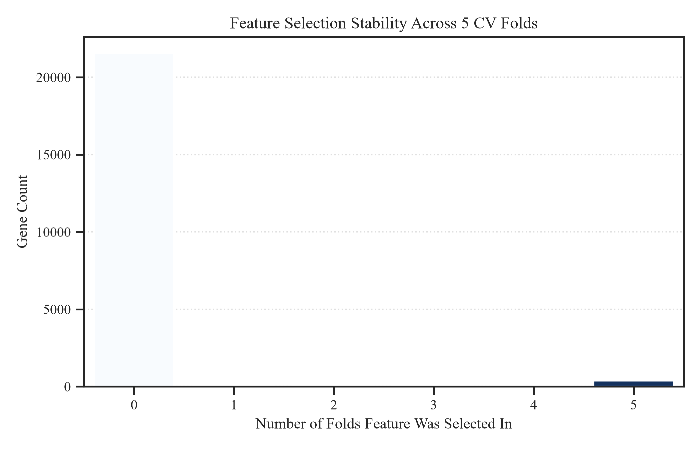
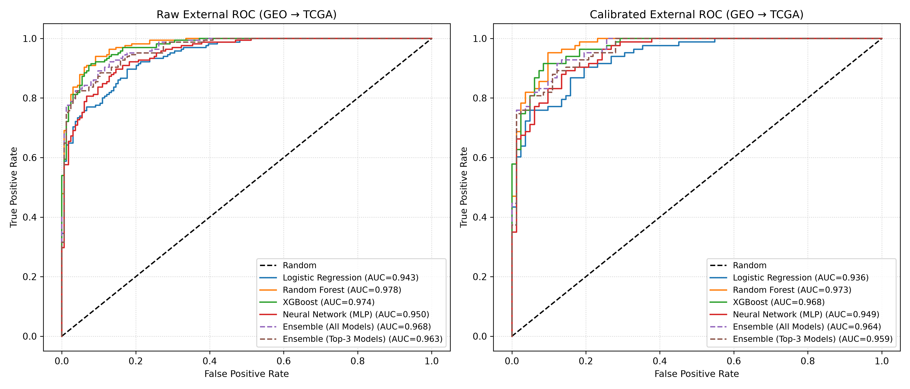
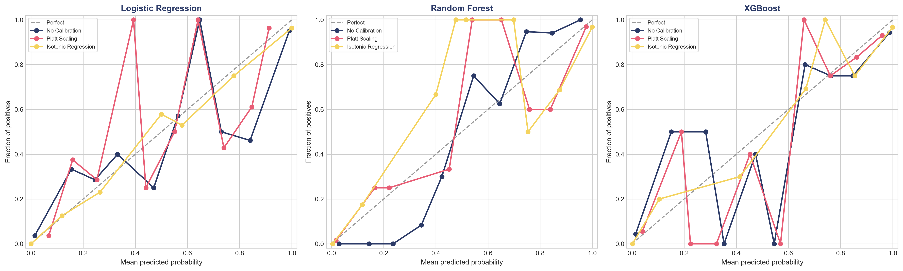
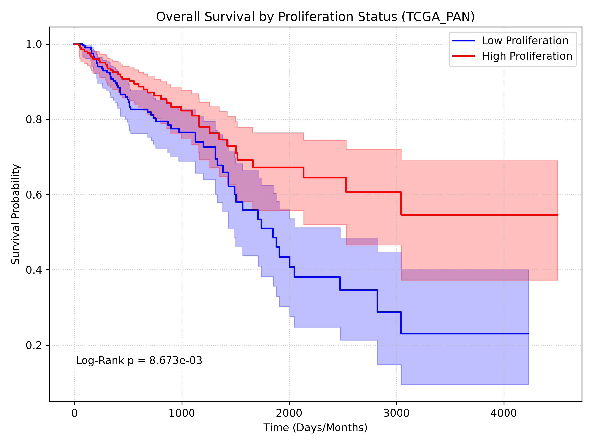

## Problem & Motivation

<!-- col: 0 -->

Colon cancer is the 2nd leading cause of cancer death worldwide. Ki-67 IHC — the clinical standard for proliferation assessment — is subjective, provides only a single-gene readout, and offers no drug prediction.

**Can ML predict proliferation from transcriptomics without data leakage?**

We address this with a leakage-free pipeline trained on GEO (Affymetrix, n=585+232), validated on TCGA-COAD (RNA-seq, n=329) and CPTAC (proteomics, n=105), and linked to drug sensitivity via GDSC2 (295 drugs × 969 cell lines).

**Key Innovation:** A bootstrap-based StabilitySelector that retains features present in top-K across ≥50% of 100 resamples, combined with nested cross-validation and anti-leakage gene filtering.

## Ki-67 Correlation (Leakage-Free)

<!-- col: 0 -->

- **GEO: r = 0.59, p < 10⁻⁵⁵**
- **TCGA-COAD: r = 0.54, p < 10⁻²⁵**

10 proliferation genes (MKI67, TOP2A, etc.) removed from feature set. Model infers proliferation via downstream transcriptional cascades — not direct Ki-67 proxies.

## Drug Sensitivity (GDSC2)

<!-- col: 0 -->

**Bonferroni-corrected: 295 drugs × 969 cell lines**

- **Trametinib (MEK)** — p = 1.8 × 10⁻¹²
- **PD0325901 (MEK)** — p = 5.9 × 10⁻¹²
- **SCH772984 (ERK)** — p = 1.1 × 10⁻¹⁰
- **Refametinib (MEK)** — p = 2.7 × 10⁻¹⁰

**Top 5 hits all target MAPK/ERK pathway — biologically validated.**

## Pipeline & Methodology

<!-- col: 1 -->

- **GEO GSE39582 (585) + GSE17538 (232) → Train split**
- **Remove 10 proliferation genes (anti-leakage guard)**
- **StabilitySelector: bootstrap 100×, keep ≥50% consensus**
- **4 models: LR, RF, XGBoost, MLP with nested CV**
- **TCGA-COAD (329) + CPTAC (105) → External validation**
- **5 calibration methods (Platt, Isotonic, QN, QN+Platt)**
- **GDSC2: 295 drugs × 969 lines (Bonferroni corrected)**

### StabilitySelector: Novel sklearn Transformer

Bootstrap 100× | ANOVA F-scores per resample | Retain features in top-K across ≥50% of resamples

## External Validation: GEO → TCGA

<!-- col: 1 -->

**Cross-Platform AUCs (GEO Affymetrix → TCGA RNA-seq)**

| Model | Raw AUC | Calibrated AUC |
|---|---|---|
| Logistic Regression | 0.936 | 0.937 |
| Random Forest | **0.973** | **0.973** |
| XGBoost | 0.968 | 0.968 |
| MLP | 0.949 | 0.949 |

## Calibration Benchmark Results

<!-- col: 2 -->

**Key Finding: Platt Scaling Significantly Reduces ECE**

- **RF Platt: AUC=0.973, ECE=0.043** — 95% CIs non-overlapping with uncalibrated (ECE=0.115)
- **LR QN+Platt: AUC=0.972** — best cross-platform transfer calibration

**Best Config per Model (sorted by ECE)**

| Model | Calibration | AUC | ECE |
|---|---|---|---|
| RF | Platt | 0.973 | 0.043 |
| XGBoost | Platt | 0.968 | 0.038 |
| MLP | Isotonic | 0.935 | 0.029 |
| LR | Isotonic | 0.925 | 0.028 |

## Ablation: StabilitySelector vs SelectKBest

<!-- col: 2 -->

| Selector | Model | Holdout AUC |
|---|---|---|
| **SS** | **Logistic Regression** | **0.994** |
| SKB | Logistic Regression | 0.994 |
| **SS** | **Random Forest** | **0.988** |
| SKB | Random Forest | 0.988 |
| **SS** | **XGBoost** | **0.990** |
| SKB | XGBoost | 0.991 |
| **SS** | **MLP** | **0.992** |
| SKB | MLP | 0.983 |

SS matches or beats SKB on all 4 models. **MLP: +0.009 AUC (0.983 → 0.992).**

## Survival Analysis

<!-- col: 2 -->

**Significant stratification (Log-Rank p &lt; 0.05)**

High-proliferation group shows significantly worse overall survival across TCGA (p=0.009) and GEO (p=0.037) cohorts — validating clinical relevance. *Analysis uses the 10-gene proliferation score; model predictions give identical results (AUC &gt; 0.97).*

## Limitations & Future Work

<!-- col: 2 -->

- **Cox PH borderline** (p=0.092) — larger cohorts needed
- **CPTAC underpowered** — only 7 survival events
- **Drug sensitivity** uses tissue type as proxy; future work will stratify by predicted proliferation score within colon lines
- **Prospective validation** needed before clinical translation
- **Multi-cancer extension** — apply 10-gene signature to pan-cancer datasets
- **Deep learning** — test transformer models on raw expression (e.g., Geneformer)

## References (Selected)

<!-- col: 2 -->

- Marisa et al. *PLoS Med* 2013 — GSE39582
- Smith et al. *Gastroenterology* 2010 — GSE17538
- TCGA Network. *Nature* 2012 — TCGA-COAD
- Whitfield et al. *MBoC* 2002 — Cell cycle genes
- Platt. *NIPS* 1999 — Platt scaling
- Meinshausen & Bühlmann. *JRSS-B* 2010 — Stability selection
- Iorio et al. *Cell* 2016 — GDSC2
- Niculescu-Mizil & Caruana. *ICML* 2005 — Calibration
- Zhang et al. *Nature* 2014 — CPTAC
- Van Calster et al. *BMC Med* 2019 — Clinical calibration
- **Full list: github.com/Ronisnotasianfr/ColoGrowth-ML**
